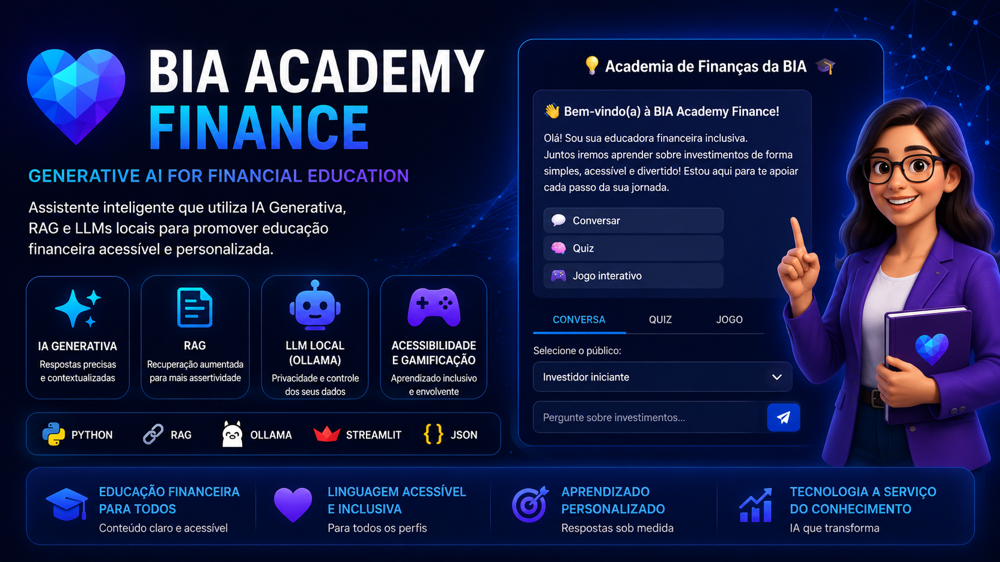

<p align="center">
  
</p>

# 💙 BIA Academy Finance

> **Generative AI for Financial Education**

Assistente inteligente desenvolvido para promover **educação financeira acessível, personalizada e inclusiva**, utilizando Inteligência Artificial Generativa, Retrieval-Augmented Generation (RAG) e Large Language Models (LLMs) executados localmente.

---

# 🎥 Demonstração

📺 **Assista à apresentação do projeto (3 minutos):**

https://youtu.be/yQBAAxrRH20

---

# 📌 Sobre o Projeto

A **BIA Academy Finance** é uma aplicação desenvolvida para demonstrar como Inteligência Artificial Generativa pode apoiar processos de aprendizagem financeira de forma personalizada.

O projeto integra uma base estruturada de conhecimento financeiro, construída a partir do projeto **MiniGuia SFN Investimentos**, permitindo que a IA forneça respostas contextualizadas, confiáveis e adaptadas ao perfil do usuário.

Além da conversação inteligente, a aplicação incorpora recursos de acessibilidade, gamificação e experiências interativas voltadas à educação financeira.

---

# 🎯 Problema de Negócio

Apesar da grande disponibilidade de conteúdos sobre investimentos, muitas pessoas ainda encontram dificuldades para acessar informações confiáveis, compreender conceitos financeiros e aprender de acordo com seu nível de conhecimento.

A BIA Academy Finance foi desenvolvida para demonstrar como Inteligência Artificial Generativa pode tornar o aprendizado mais acessível, personalizado e interativo, aproximando tecnologia e educação financeira.

---

# ⭐ Por que este projeto é relevante?

Grande parte dos projetos de IA Generativa limita-se à integração de um modelo de linguagem.

A **BIA Academy Finance** demonstra uma aplicação completa, integrando diferentes componentes para resolver um problema real de negócio: democratizar o acesso à educação financeira.

O projeto reúne conhecimentos em:

- 🧠 Inteligência Artificial Generativa
- 📚 Retrieval-Augmented Generation (RAG)
- 🗂️ Engenharia de Conhecimento
- 💬 Prompt Engineering
- 🎮 Gamificação
- ♿ Acessibilidade Digital
- 👤 User-Centered Design (UCD)

Mais do que um chatbot, a BIA demonstra como IA pode ser utilizada para criar experiências inteligentes de aprendizagem.

---

# 🏗 Arquitetura da Solução

```text
                 Base de Conhecimento
            (MiniGuia SFN Investimentos)
                         │
                         ▼
             Recuperação Inteligente (RAG)
                         │
                         ▼
                  LLM Local (Ollama)
                         │
                         ▼
           Geração de Respostas Inteligentes
                         │
        ┌────────────────┼────────────────┐
        ▼                ▼                ▼
 Conversação IA      Quiz Financeiro   Jogo Educativo
                         │
                         ▼
                Interface Streamlit
```

---

# 🚀 Principais Funcionalidades

- 💬 Assistente financeiro inteligente
- 📚 Respostas contextualizadas utilizando RAG
- 🧠 Integração com LLMs locais via Ollama
- 🎮 Quiz sobre educação financeira
- 🕹️ Jogo educativo interativo
- 👥 Conteúdo adaptado para diferentes perfis de usuários
- ♿ Interface acessível
- 📖 Base estruturada de conhecimento financeiro

---

# 🛠️ Tecnologias Utilizadas

| Categoria | Tecnologias |
|-----------|-------------|
| Linguagem | Python |
| Interface | Streamlit |
| IA Generativa | Ollama |
| Framework IA | LangChain |
| Base de Conhecimento | JSON |
| Engenharia de Prompt | Prompt Engineering |
| Recuperação de Conhecimento | RAG |

---

# 📂 Estrutura do Projeto

```text
BIA-Academy-Finance/
│
├── assets/
├── data/
├── prompts/
├── src/
├── app.py
├── requirements.txt
└── README.md
```

---

# 💼 Competências Demonstradas

Durante o desenvolvimento deste projeto foram aplicados conhecimentos em:

- IA Generativa
- Prompt Engineering
- Retrieval-Augmented Generation (RAG)
- Engenharia de Conhecimento
- Desenvolvimento de aplicações com Streamlit
- User-Centered Design (UCD)
- Acessibilidade Digital
- Estruturação de bases de conhecimento
- Desenvolvimento de soluções orientadas ao usuário

---

# 🌐 Papel no Ecossistema

A **BIA Academy Finance** representa a evolução natural da base de conhecimento construída no projeto **MiniGuia SFN Investimentos**, transformando conhecimento estruturado em uma aplicação inteligente capaz de interagir com usuários em linguagem natural.

```text
MiniGuia SFN Investimentos
            │
            ▼
 Engenharia de Conhecimento
            │
            ▼
 Recuperação Inteligente (RAG)
            │
            ▼
 BIA Academy Finance
            │
            ▼
 Educação Financeira Inteligente
```

---

# 🔮 Próximos Passos

- Histórico das conversas
- Recomendações personalizadas de conteúdos
- Dashboard de evolução do usuário
- Integração com APIs financeiras
- Ampliação da base de conhecimento
- Novos recursos de acessibilidade

---

# 👩‍💻 Autora

**Barbara Freitas**

📊 Data Analytics • Machine Learning • Generative AI • Financial Intelligence

🔗 GitHub  
https://github.com/BARBARANFS

🔗 LinkedIn  
https://www.linkedin.com/in/barbarafreitas-dataanalytics

---

<div align="center">

⭐ Se este projeto foi interessante para você, considere deixar uma estrela no repositório.

</div>
